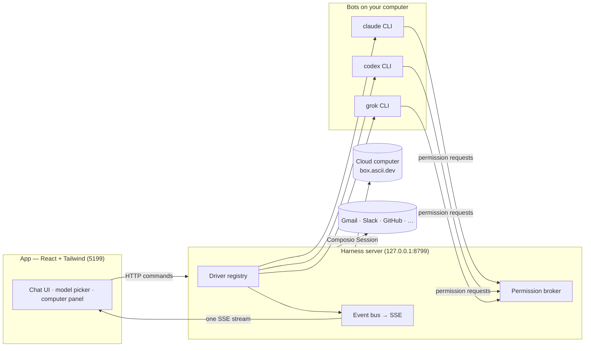

<div align="center">

# BotFleet

**Your own fleet of AI bots, in a chat app.**

<sub>A distribution of the open-source <a href="https://github.com/jaywedgeworth22/BotFleet">BotFleet</a> — extended with fleet-grade add-ons for running a coordinated team of bots on your own Mac, with an iOS companion.</sub>

<br>
<br>

<a href="https://botfleet.app"><b>botfleet.app</b></a> &nbsp;·&nbsp; <a href="https://testflight.apple.com/join/ER6sPNMh">iOS companion on TestFlight (public beta)</a> &nbsp;·&nbsp; <a href="https://github.com/jaywedgeworth22/BotFleet">upstream BotFleet</a>

</div>

## What BotFleet Adds

BotFleet tracks upstream BotFleet closely and layers fleet-oriented add-ons on top.  The live status of every add-on — Established vs Beta — is kept at **[botfleet.app](https://botfleet.app)**.  Highlights:

- **Always-on iMessage relay** — a host daemon plus LaunchBots keep every bot group chat in Messages.app wired to the BotFleet backend in both directions, so the fleet stays reachable from a phone.
- **iOS companion infrastructure** — App Groups and Associated Domains entitlements, universal links, and a public TestFlight for the companion app.
- **Multi-tier model fallbacks** — first, second, and third choice models per bot with automatic failover and retry on rate limits, quota, or outages.
- **Native DeepSeek driver** — DeepSeek V3 and R1 join Claude, Codex, and Cursor via a native ACP driver plus the dsh bot.
- **Mid-task restart recovery**, **usage and cost telemetry**, **multi-repo channels with clickable file links**, **custom webhook domains**, **menu bar tray integration**, **dynamic system theme**, and more — see [botfleet.app](https://botfleet.app) for the full, current list with per-feature provenance.

## Relationship to BotFleet

BotFleet is a friendly fork of [jaywedgeworth22/BotFleet](https://github.com/jaywedgeworth22/BotFleet) by Milind Soni and contributors, and inherits its architecture, license, and most of its documentation.  Everything below this line documents the BotFleet foundation that BotFleet ships with; where upstream's name appears, BotFleet behaves the same unless an add-on listed at [botfleet.app](https://botfleet.app) says otherwise.

---

## Why

One assistant in one box is the wrong shape for bots. BotFleet is an open-source take on **Grok Bot** —
it keeps the idea (AI as a *messaging app*: a roster of bots you chat with, each with its own personality,
memory of its thread, model, computer, and apps) and rebuilds it open, local-first, and on the bots you
already have:

- **Bring your own bots.** Bots run on the `claude`, `codex`, and `grok` CLIs installed on your own machine
  — your existing logins and subscriptions, no new accounts, no proxy in the middle. Point any engine at a
  custom CLI binary (a versioned build or wrapper) in **Settings → Engines**.
- **Local first.** One small harness server on `127.0.0.1` owns every bot process. Transcripts, keys, and
  events live in `~/.botfleet`, not a cloud.
- **Bots with hands.** Each bot can use a cloud Linux desktop, an isolated Local VM, or—where the platform
  safety boundary is currently certified—your own computer, plus 500+ apps through Composio. Host control is
  available on macOS and Ubuntu Xorg after explicit opt-in. Ubuntu Wayland host control remains disabled while
  issue #345 is resolved.

## Features

<table>
<tr>
<td width="50%" valign="top">

### 🧠 Pick a brain per bot

A model picker with a provider rail — Claude and Codex models side by side, defaults marked, unavailable
providers dimmed with the reason. Switch a bot's model mid-conversation.


</td>
<td width="50%" valign="top">

### 🖥️ Every bot gets a computer

Open the Computer panel and the bot's cloud desktop spins up on its own — live screen preview while it
works, "Open desktop" to take over in your browser, or point the bot at *this Mac* instead.


</td>
</tr>
<tr>
<td width="50%" valign="top">

### 🙋 Bots ask before they act

Shell commands, file edits, and questions surface as inline cards — Allow / Deny / answer in chat. A
permission broker turns every risky action into a decision you make, for cloud and local computers alike.


</td>
<td width="50%" valign="top">

### 🔌 Connected apps

A one-click marketplace over Composio Sessions: Gmail, Slack, GitHub, Notion, Linear and hundreds more.
OAuth once, and every bot can use them as tools.


</td>
</tr>
<tr>
<td width="50%" valign="top">

### 🗂 Manage bots like chats

Right-click any bot: pin, mark unread, edit profile, duplicate, copy conversation ID, hide, delete. It's a
messaging app — your bots behave like contacts.


</td>
<td width="50%" valign="top">

### 🔑 Keys once, everything lights up

Paste credentials in App Settings — they persist locally and the provider fleet hot-reloads instantly.
Secrets are write-only: the UI only ever sees "configured" flags.


</td>
</tr>
</table>

### #️⃣ Channels for every context

Keep Work, Personal, and each project in separate channels without cloning your bots. Every channel has
its own transcript, shared instructions, working folder, responder rules, and editable bot roster. File a
channel and its bots under a named context, then rename it or change its members whenever the team changes.

### 📦 Install a complete team from one Markdown file

Browse outcome-driven teams on [BotMRR](https://botmrr.io), then choose **Add to BotFleet**. The app
opens a review screen before creating the bots, Chief of Staff, channels, playbooks, connector checklist,
and suggested routines. You can also import the same `.md` file from disk or paste its public GitHub URL
in **Teams → Import**.

The format stays portable: BotFleet reads the structured YAML frontmatter for a reliable one-click
install, while Grok, Claude, ChatGPT, and people can follow the ordinary Markdown playbook. Connections
remain off until you approve them, routines arrive paused, and packages never carry credentials,
conversations, permissions, memory, or computer access. Browse the
[open-source playbook repository](https://github.com/milind-soni/botfleet-teams) or read its
[portable format](https://github.com/milind-soni/botfleet-teams/blob/main/FORMAT.md).

### 🎧 Bots that talk back

Press the speaker on any reply, or switch a bot to read its answers out as they land — so you can listen
to what ran overnight while you make breakfast. Hit **call** and it's a conversation: it hears you, tells
you what it's doing while it works, and asks for approvals out loud.

Bring your own ElevenLabs key — paste it once in App Settings, pick a voice, and every bot can talk.
Give a bot its own voice and a channel stops sounding like one person.

**Also in the box:** streaming replies with tool-run activity chips · native macOS dictation from the
composer mic (on-device Apple speech recognition — desktop app) · SupaMaus cursor mascots with role-aware
expressions · screenshots of the bot's work folded into the transcript.

## How it works

Two processes. The app holds no transports of its own — it sends typed commands over HTTP and folds one SSE
event stream into state. The harness server owns every bot process and normalizes each provider's native
protocol into one canonical runtime event stream (logged per-thread as NDJSON).



| Layer | Where | What it does |
|---|---|---|
| Drivers | `server/drivers/` | One per provider: Claude, Codex, and Grok Build over their local CLIs (stream-JSON / JSON-RPC / ACP), plus a cloud-computer bot. Unknown drivers degrade to "unavailable", never crash the fleet. |
| Harness | `server/harness/` | Registry (configs → live instances) and the fan-in event bus every client folds. |
| API | `server/index.ts` | Bots, turns, approvals, model catalog, computer lifecycle, connectors, config — HTTP + SSE. |
| Voice | `server/tts/` | ElevenLabs, bring your own key. Runs on the harness so the key never reaches the UI; markdown is rewritten into something worth hearing before it is spoken. |
| App | `src/` | The chat shell. Server-backed store, one reducer, zero client-side transports. |
| Desktop | `electron/` | macOS, Windows, and Ubuntu shells with an embedded harness and platform capabilities; Apple speech stays macOS-only, Ubuntu Xorg has opt-in local control, and Wayland remains fail-closed. |

### Orchestrate BotFleet over MCP

BotFleet ships a stdio MCP server for external clients such as Claude Desktop and Cursor. It exposes a
deliberately bounded team control plane: inspect bots and channels, read/search compact transcript pages,
create and configure bots/channels/tasks, send work, wait for completion, switch models, and interrupt turns.
It does **not** expose approval grants, deletion, arbitrary settings, credentials, or computer lifecycle.

See [MCP server setup and tool reference](docs/mcp-server.md).

## Quick start

**Released builds ([v0.1.37](https://github.com/jaywedgeworth22/botfleet-releases/releases/tag/v0.1.37)):** the harness server is embedded, so no separate server setup is required.

| | Download | Install |
|---|---|---|
| **macOS** (Apple silicon) | [BotFleet.dmg](https://github.com/jaywedgeworth22/botfleet-releases/releases/download/v0.1.37/BotFleet.dmg) | Drag it to Applications, open it. Signed & notarized. |
| **macOS** (Intel) | [BotFleet-intel.dmg](https://github.com/jaywedgeworth22/botfleet-releases/releases/download/v0.1.37/BotFleet-intel.dmg) | Same app, built for Intel Macs. Signed & notarized. |
| **Windows** (x64) | [BotFleet-setup.exe](https://github.com/jaywedgeworth22/botfleet-releases/releases/download/v0.1.37/BotFleet-setup.exe) | Run it — one-click, per-user, no admin rights. The installer isn't code-signed yet, so SmartScreen shows "unknown publisher": **More info → Run anyway**. |
| **Ubuntu 24.04** (x64) | [BotFleet-amd64.deb](https://github.com/jaywedgeworth22/botfleet-releases/releases/download/v0.1.37/BotFleet-amd64.deb) · [BotFleet.AppImage](https://github.com/jaywedgeworth22/botfleet-releases/releases/download/v0.1.37/BotFleet.AppImage) | Install the `.deb` with APT (recommended), or make the AppImage executable and run it. Beta; GNOME is the supported desktop. |

See the [Ubuntu Desktop guide](docs/linux-desktop.md) for installation, capabilities, and troubleshooting.

**From source:**

```sh
git clone https://github.com/jaywedgeworth22/BotFleet && cd BotFleet
pnpm install

pnpm dev:server    # harness server → 127.0.0.1:8799
pnpm dev           # app → http://127.0.0.1:5199
pnpm dev:desktop   # Electron shell; keep the two commands above running
```

Requirements: **macOS, Windows, or Ubuntu 24.04 x64**, **Node 24+**, **pnpm**, and at least one bot CLI — [`claude`](https://claude.com/claude-code),
[`codex`](https://github.com/openai/codex), or [`grok`](https://x.ai/cli) — installed and logged in. They appear
in the model picker automatically.

Package the desktop application:

```sh
pnpm package:mac      # macOS: DMG + ZIP; requires Swift/Xcode tools
pnpm package:win      # Windows: installer + ZIP
pnpm package:linux    # Ubuntu x64: .deb + AppImage + verified CUA runtime
```

### Desktop capability status

| Capability | macOS | Ubuntu 24.04 Xorg | Ubuntu 24.04 Wayland |
|---|---|---|---|
| Packaged app, embedded harness, local bot CLIs | Supported | Beta | Beta |
| Composio and Box/cloud computers | Supported | Beta | Beta |
| Explicit preview-only local screen capture | Supported | Beta | Beta |
| Bot control of this computer | Supported | Beta, explicit opt-in | Disabled: Wayland safety gate |
| Native on-device dictation | Supported | Planned | Planned |

The Linux preview is user-initiated and never enables local bot control or Auto routing. On Xorg, the reviewed Cua
Driver 0.19.3 runtime starts only after explicit opt-in and without its full-screen cursor overlay. On Wayland the
app never starts it and clears legacy opt-ins while that real-seat safety gate remains unresolved. Chat, preview,
Cloud, and Local VM remain available on both sessions. See the [Ubuntu Desktop guide](docs/linux-desktop.md) and tracking
issues [#29](https://github.com/jaywedgeworth22/BotFleet/issues/29),
[#345](https://github.com/jaywedgeworth22/BotFleet/issues/345), and
[#113](https://github.com/jaywedgeworth22/BotFleet/issues/113).

The Linux packager downloads only the tag-pinned upstream archive during the build, verifies its size, SHA-256,
complete member allowlist, and inner executable hashes, then packages only the CLI and cursor-theme sidecar. The
installed app never downloads or self-updates native automation code. Cua's MIT notice, Inter's SIL OFL, a generated
third-party license report, and a CycloneDX inventory ship with the runtime. See
[`third_party/cua-driver/`](third_party/cua-driver/) for the reviewed provenance record.

These credentials are optional — local chat works without them. Paste a key once in **App Settings** (gear
in the sidebar footer) when you want to enable its integration:

| Credential | What it enables | Where to get it |
|---|---|---|
| Composio project key (`ak_…`) | Connect Gmail, GitHub, Slack, Notion, and other apps to your bots | [BotFleet Composio setup](docs/composio.md) |
| Box API key | Give bots an isolated remote Linux computer with a desktop and terminal | [Box API key guide](https://docs.ascii.dev/box/api-keys) |
| ElevenLabs key | Read replies aloud, and call your bots | [ElevenLabs API keys](https://elevenlabs.io/app/settings/api-keys) |

Composio and Box are third-party services with their own accounts and terms. Box is a paid service after
its trial, and using a cloud computer may incur charges.

```sh
pnpm typecheck     # app + server
pnpm test          # unit, driver, API, and desktop capability tests
pnpm build         # typecheck + production build
pnpm check:electron # syntax-check Electron main/preload files
pnpm package:win   # Windows installer + zip → release/
pnpm package:linux # Ubuntu x64 .deb + AppImage → release/
```

### Routines, webhooks, and resource triggers

Routines can run once or on selected weekdays, using either a MAUS's configured model/computer or the
Cloud VM runner. Webhook triggers are independent from schedules but reuse the same queued task executor
and calendar receipts. Resource triggers sample local disk, RAM/swap, and optional CPU
load while BotFleet is running and enqueue the same kind of task when a threshold is
crossed.

BotFleet starts a webhook-only receiver on `127.0.0.1:8800` by default (or one port above `OMB_PORT`).
Set `OMB_WEBHOOK_PORT` to choose another port. A webhook secret is shown once when the trigger is created
or rotated. Bearer authentication is recommended so the secret stays out of request URLs and most access
logs; a single capability URL remains available for senders that cannot configure headers. The receiver
exposes only `/health` and secret `/hooks/...` endpoints; it never exposes the app's broader API.
BotFleet must remain running to accept a delivery. For public internet delivery and mobile app access, BotFleet now offers **TryCloudflare (Free URL)** integration built directly into the app. 

### Remote Access, Mobile App, and Webhooks

To connect the BotFleet iOS app or receive public internet webhooks while the app is running on your Mac, you have three options:

1. **TryCloudflare (Free URL)** (Recommended for Webhooks): BotFleet can instantly spin up a Cloudflare Tunnel giving you a persistent `*.trycloudflare.com` URL. This is deeply integrated — just toggle it on in Settings. It provides a long-lived, secure public URL without requiring a Cloudflare account or custom domain setup.
2. **Tailscale**: For users prioritizing strict security and phone linking (without needing public webhooks), Tailscale is fully operational and supported out-of-the-box via MagicDNS.
3. **Custom Domain**: For production setups, you can bring your own Cloudflare API Token to route traffic through a custom domain (requires configuring a Cloudflare Zero Trust account and setting up DNS).

## Status

Early but real — the loop works end to end: message → bot → streamed reply → tools → approvals →
computer use. macOS, Windows, and Ubuntu 24.04 x64 have released builds; Ubuntu remains a beta with the
capability limits above. Rough edges to expect: hosted/mobile connectivity is still being built, and webhook
triggers currently use the local receiver rather than an always-on hosted relay.
Voice needs an ElevenLabs key, and calls are macOS-only for now (they ride the same on-device dictation as
the composer mic) — see [`docs/voice-mode.md`](docs/voice-mode.md) for the design and the known gaps.

Contributions welcome — the driver SPI in [`server/contracts.ts`](server/contracts.ts) is deliberately
small; adding a provider is one file in [`server/drivers/`](server/drivers/) plus a one-line registration.

## Support the project

BotFleet is free and open source. If it does real work for you, you can
[buy the project a coffee or become a monthly supporter](https://buy.polar.sh/polar_cl_EEzWmormSVBD151HkmkyId9j0GPXina0KurfS1fYYcO) —
one-time any amount, or monthly. Payments are handled by [Polar](https://polar.sh/supamaus),
which takes care of receipts and taxes; nothing about the app ever sits behind a paywall.

## License

[Apache License 2.0](LICENSE) © 2026 Milind Soni and BotFleet contributors.

Packaged Cua Driver components retain their upstream MIT, SIL OFL 1.1, MPL-2.0, and other dependency terms;
the corresponding notices, license texts, source locations, and SBOM are in
[`third_party/cua-driver/`](third_party/cua-driver/) and ship beside the native runtime.

BotFleet is an independent, open-source project inspired by Grok Bot. It is
not affiliated with, endorsed by, or associated with xAI; "Grok" is a trademark
of its respective owner.
