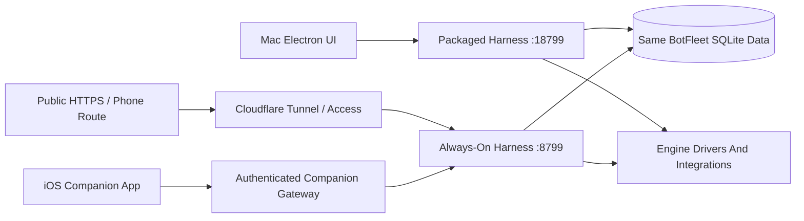

# BotFleet iOS, macOS, Engines, And Integrations Audit

Review date: September 9, 2026, Central Time.  Source baseline: [`121cb85a`](https://github.com/jaywedgeworth22/BotFleet/commit/121cb85aa3ebb85cb2d5b9233bc69838979a88f7).  Parent: [#263](https://github.com/jaywedgeworth22/BotFleet/issues/263).  Audit board: `55bff4ee` on [THE BOARD](https://mac.jays.services/board).

## Assessment

BotFleet has substantial working infrastructure and broad test coverage, but its current Mac setup does not have one authoritative running harness.  The desktop and public endpoint reach different processes that both open the same SQLite data.  Their integration configuration and recorded activity differ.  Resolve that ownership problem before diagnosing every UI discrepancy as an independent provider problem.

The next priorities are the broken PagerDuty delivery route, Composio connectivity, unreliable RAG readiness, companion permission boundaries, and task-safe iOS sends.  Source review also found incorrect failover ownership, history loss after failed provider resume, and misleading subscription cost attribution.  These are concrete follow-ups; a green unit suite does not establish that the configured fleet can complete its operational workloads.

This audit changes documentation and tracking records.  It does not restart harnesses, change credentials or routes, send test incidents, activate Tailscale, dispatch model inference, or ship a product build.  Findings marked as source-confirmed have not necessarily been reproduced against a real provider or physical phone.

## Evidence And Build Identity

| Layer | Observed State | Meaning |
| --- | --- | --- |
| Reviewed source | `121cb85a` in an isolated Codex worktree | All source references and defect claims use this baseline |
| Always-on harness | Detached runtime checkout at `102d94a6`; port 8799; PID 93951; `static:false` | The public health endpoint reached this process |
| Packaged Mac app | Version 1.0.30; separate child on port 18799; PID 97812; `static:true` | The Mac UI used this second harness |
| Shared storage | Both PIDs simultaneously held `messages.db`, WAL, and SHM under the default BotFleet data directory | Direct evidence of concurrent data ownership; corruption was not established |
| Public endpoint | HTTPS health returned 200 and the 8799 PID; unauthenticated management routes redirected to Cloudflare Access | Reachability and access protection worked for those requests; this is not a paired-phone round trip |
| Published desktop release | Latest GitHub release `v0.1.38`, August 31; four DMGs, no `latest-mac.yml` or ZIP updater payload | Published updater assets lag the installed/source version; release workflow recovery remains open |
| Physical iPhone/TestFlight | Not inspected or paired in this audit | Existing board deployment claims were not used as proof of the currently installed phone build |

The review combined repository inspection, installed-bundle inspection, safe local API reads, open-file ownership checks, public HTTP checks, Sentry/PagerDuty read-only metadata, fleet recall, and automated tests.  Credentials, webhook capability URLs, user prompts, and raw conversation output are omitted.  Point-in-time observations can change after another seat updates the app.

The diagram separates the observed public health path from the companion architecture.  A physical iPhone-to-gateway-to-engine round trip was not exercised.  The two-writer condition is observed; a transient health-probe timeout is a source-supported way to produce it, not a captured explanation of the original launch.

## What The Two Harnesses Report

| Check | Public-Route Harness :8799 | Desktop Harness :18799 |
| --- | --- | --- |
| Bots / routines | 12 / 14 | 12 / 14 |
| Composio | Unconfigured / unavailable | Configured self-hosted; connected-account read repeatedly fails with HTTP 500 `fetch failed` |
| Sentry | Disabled, no configured source | Enabled, configuration supplied by Infisical |
| Infisical | Disabled, zero managed values | Enabled, five managed values |
| Usage integration | Unconfigured | Configured |
| RAG status | Roughly 30-second timeout; reports not ready | Ready via local recall CLI, approximately 3.8 seconds |
| Webhook definitions | Five | Six, including an additional probe definition |
| Recorded webhook attempts | 406: 367 accepted, 2 ignored, 37 rejected | 403: 364 accepted, 2 ignored, 37 rejected |
| Recorded routine runs | 774 | 771 |

These differences make a single generic “connected” indicator insufficient.  Settings should identify the serving harness, build, data owner, and the age and depth of each health check.  Configuration presence, transport reachability, authentication, capability discovery, and a completed operation are different states.

## Engine Operation And Current Readiness

The 12 current bot primary assignments were six Grok, four DSH, and two Claude.  Codex, Antigravity, and MiniMax were enabled but were not those bots' primary selections in the captured snapshot.  A capability flag describes the driver contract; it does not prove a successful current tool call.

| Engine | How BotFleet Uses It | Live Evidence | Main Improvement |
| --- | --- | --- | --- |
| Claude | `claudeAgent`: CLI stream-json, per-turn subprocess, native session resume, steering, approvals and MCP mounts | CLI 2.1.266; reports authenticated, subscription billing | Enforce bot-specific global MCP access; classify API-equivalent subscription cost separately from actual spend; fix shared failover attribution |
| Codex | `codex`: persistent app-server JSON-RPC, native thread resume, dynamic tools/MCP and approvals | CLI 0.151.0; reports authenticated, subscription billing | Replay visible history if provider resume fails; preserve the actual active provider for cancellation and usage |
| Antigravity | `antigravityAgent`: print-mode CLI with a globally leased MCP configuration | CLI 1.1.26 available; quota data returned; authentication not established by its version-only probe | Normalize upstream quota identifiers to catalog/shared quota groups; distinguish installation from login readiness; current print mode does not offer local-computer approval capability |
| DSH | `dshAgent`: shared ACP machinery; this Mac supplies an external `dsh-acp` bridge override | Bridge 1.3.0 reports available/authenticated; no MCP capability | Finish the owned first-class bridge lane; fresh source defaults still target the stock non-ACP entry point documented in the prior DSH audit |
| MiniMax | `minimax`: metered HTTP chat-completions/SSE with a bounded driver-owned tool loop | Enabled, key presence/auth metadata reports available | This is not control of the MiniMax Code desktop/CLI app; current tool host exposes bot coordination, not full shell/files/browser/Composio/phone/RAG support; cost work is already in PR #257 |
| Kimi | `kimiAgent`: CLI ACP with provider sessions and shared MCP mounts | Disabled in the current configuration | Keep disabled status explicit; validate auth, model selection, resume, cancellation and permitted tools when deliberately enabled |
| Grok | `grokAgent`: CLI ACP with shared MCP and cancellation | CLI 1.0.13 reports authenticated; six primary assignments | Shared ACP resume/deadline/failover fixes matter to the live configuration; the separate direct `grokApi` driver duplicates request context, a latent issue not the active Grok path |
| Cursor | `cursorAgent`: CLI ACP with model/config negotiation and shared MCP | 8799 cannot find its configured binary; 18799 finds version 2026.08.11 but reports unauthenticated | Resolve executable/auth discovery consistently across launch environments; exclude known-unavailable or logged-out instances from automatic fallback |

DeepSeek Code, the DSH harness, and a DeepSeek model inside Cursor are distinct integrations.  Other enabled instances included missing Qwen/Hermes/Pi binaries and unconfigured Computer/OpenAI-compatible backends.  Disabled Droid/OpenCode entries are not outages.  Some saved fallback chains repeat the primary selection; setup validation should identify ineffective duplicates.

The most consequential shared source defects are: completion/cooldown telemetry uses the persisted primary after a per-turn fallback; the stall watchdog interrupts that primary instead of the actual session owner; automatic fallback checks enabled state without enough health/auth/cooldown filtering; and failed ACP/Codex resume silently starts a fresh session after transcript replay has already been suppressed.  Together these can make the displayed engine, actual running child, cost attribution, and visible conversation disagree.

## Integrations And Connectivity

| Integration | Verified Operation | Gap / Next Acceptance Check |
| --- | --- | --- |
| Composio | Desktop configuration says self-hosted; connected-account GET repeatedly fails; service harness lacks configuration | Diagnose transport/upstream failure before blaming credentials; show configured versus usable; then verify explicit account scoping and a harmless read operation |
| Sentry | Six unresolved high-priority error records from September 8 were visible; the configured alert workflow and PagerDuty action were enabled | Historical ingestion does not prove today's public harness reports; repair instance/config parity and separately verify harness, renderer, iOS and release identity; preserve existing redaction and opt-out work |
| PagerDuty | Active triggered/resolved webhook subscription exists; its destination uses a management API path and a read-only GET probe redirects to Cloudflare login; BotFleet recorded zero PagerDuty deliveries | Point delivery at the intended capability-authenticated ingress under the correct edge policy; validate provider retries and accepted delivery without creating an uncontrolled live incident |
| Fleet RAG | Recall search returned results; collection stats reported approximately 40,429 points and healthy embedding service; desktop status succeeded | Public-route status timed out; local CLI precedence ignores the intent of an explicit service route; readiness can be positive despite backend/protected-route failure; add bounded, route-specific health |
| Cloudflare Tunnel | Public health was 200; protected management routes challenged unauthenticated access | Verify the exact companion and webhook paths independently; tunnel connection health alone does not prove origin/auth/application success |
| Tailscale | Not used for this audit, as requested | Source treats tailnet routes as optional; hosted pairing pins hosted-only policy and does not require tailnet fallback |
| Infisical / Usage | Desktop has configured integration metadata while the always-on harness does not | Display configuration provenance and reload status; converge on one runtime owner and explicit billing semantics |

Sentry-to-PagerDuty alerting and PagerDuty-to-BotFleet webhook delivery are separate directions.  The first has an enabled rule; the second has a verified URL/Access problem.  No alert, incident, OAuth grant, account mutation, or model task was generated to test them.

The webhook ingress already authenticates capability URLs and deduplicates supported delivery headers.  The improvement is provider-aware event identity and durable replay handling, particularly for PagerDuty/Sentry payloads; this audit does not claim that webhook authentication is absent.

The [Cloudflare monitoring documentation](https://developers.cloudflare.com/tunnel/monitoring/) distinguishes tunnel connectivity from application reachability.  [PagerDuty's webhook documentation](https://support.pagerduty.com/main/docs/webhooks) describes event identities and verification, while [Composio sessions](https://docs.composio.dev/docs/sessions-via-mcp) provide the account/session model relevant to connector acceptance.  These references inform follow-up criteria; local observations establish the defects above.

## iOS Review

The source covers pairing/discovery, Keychain restore, hosted/LAN/tailnet selection, SSE hydration and replay, bots/rooms/tasks, approvals, queueing, attachments, dictation, cloud computer access, settings, routines, APNs, and Live Activities.  The strongest gaps are not cosmetic:

- A paired profile PATCH can change automation, connector, computer and host-directory fields despite the route's documented safe subset.  Its schema must enforce the intended companion trust boundary.
- Background APNs receipt invokes notification navigation and can switch the active Mac task without a user tap.  Navigation belongs to the notification-response path, while background receipt should only refresh state.
- Sends and Stop omit the server-supported thread binding, allowing a concurrent desktop task switch to redirect work.  Sends also omit the supported idempotency key, so a lost response followed by retry can duplicate execution.
- “Always Allow” is offered even though the sidecar intentionally denies the standing-grant route.  Failed saves dismiss the bot settings form; model edits lose reasoning effort; some accepted attachment formats cannot be fetched through the companion allowlist.
- Background fetch reports completion before its asynchronous refresh finishes.  Live Activities are currently foreground-updated and can remain stale while suspended.

Existing protections are meaningful: route-default-deny, per-device cloud-computer checks, hosted-only route pinning, endpoint normalization, Keychain device-only storage, revoked-device replay checks, SSE cursor resume/full hydration, bounded attachments, and notification sequence deduplication.  The requested fixes should preserve these properties.

## macOS Product And Operations Review

The Electron attach/spawn design, static UI proxy, config/credential bridge, updater, renderer hydration, chat errors/approvals, and release packaging were inspected.  Thirty focused desktop lifecycle/proxy tests passed.  The next product improvements are a reliable ownership/compatibility handshake, visible partial-hydration errors, update-setting save feedback, and an operator diagnostics view.

The app was inspected read-only through its Settings surfaces.  Duplicate Bot Chats were visible in the installed app, but the reviewed main baseline already includes the source fix in PR #262.  This is build lag rather than a reason to create a duplicate source-fix ticket.  VoiceOver, keyboard traversal, reconnect race behavior, and long-session responsiveness still need targeted interaction/profiling; the related P3 item is explicitly validation work rather than a claimed reproduced accessibility defect.

Recorded routine outcomes warrant an operational follow-up: the preceding 24 hours contained 101 runs, of which 47 failed, 53 completed, and one was cancelled.  Seven days contained 668 runs, with 347 failed, 318 completed, and three cancelled.  These are stored statuses, not a measured current engine failure rate.  Historical capability failures and previous defects must be separated from new failures after single-owner recovery.

## Prioritized Findings And Tracking

The 35 findings map to 34 distinct GitHub issues: 32 newly created follow-up issues and two existing issues expanded with evidence (#93 and #188).  Every item below has a canonical Mac board reference and GitHub issue, or adds evidence to an already-owned issue.  New implementation items remain open; publishing this audit does not mark their remediation complete.  P1 indicates operational correctness, trust, or an important blocked integration; P2 indicates reliability/capability gaps; P3 indicates validation and polish.  Latent source defects and recommended validation are identified in their issue bodies.

| ID | Priority | Finding | GitHub | Mac Board |
| --- | --- | --- | --- | --- |
| D1 | P1 | Packaged fallback can create a second harness against the shared data root | [#264](https://github.com/jaywedgeworth22/BotFleet/issues/264) | `f781c56d` |
| D2 | P2 | Static harness attachment has no build or API compatibility check | [#265](https://github.com/jaywedgeworth22/BotFleet/issues/265) | `e4190ce1` |
| D3 | P2 | Initial renderer hydration swallows all REST failures | [#266](https://github.com/jaywedgeworth22/BotFleet/issues/266) | `62a56733` |
| D4 | P2 | Automatic-update setting gives no failed-save or HTTP-status feedback | [#267](https://github.com/jaywedgeworth22/BotFleet/issues/267) | `1ca6cb49` |
| D5 | P3 | Validate desktop reconnect cleanup and accessible failure announcements | [#268](https://github.com/jaywedgeworth22/BotFleet/issues/268) | `5ee62380` |
| R1 | P1 | Repair PagerDuty delivery to the authenticated webhook ingress | [#269](https://github.com/jaywedgeworth22/BotFleet/issues/269) | `0dd2ce22` |
| R2 | P1 | Restore Composio connectivity and report configured versus usable status separately | [#270](https://github.com/jaywedgeworth22/BotFleet/issues/270) | `0ade868c` |
| R3 | P1 | Bound fleet RAG fallback and honor explicitly selected service routes | [#271](https://github.com/jaywedgeworth22/BotFleet/issues/271) | `2d627f55` |
| R4 | P2 | Do not report RAG ready when backend or protected-route checks fail | [#272](https://github.com/jaywedgeworth22/BotFleet/issues/272) | `432930fc` |
| R5 | P2 | Deduplicate Sentry and PagerDuty redeliveries with provider event identities | [#273](https://github.com/jaywedgeworth22/BotFleet/issues/273) | `d141ec97` |
| R6 | P2 | Add an operator acceptance matrix for builds engines and integration health | [#274](https://github.com/jaywedgeworth22/BotFleet/issues/274) | `7e582b82` |
| EN-01 | P1 | Fallback outcomes mutate the primary engine's cooldown and attribution | [#275](https://github.com/jaywedgeworth22/BotFleet/issues/275) | `46f08797` |
| EN-02 | P1 | Stall cancellation targets the original engine after failover | [#276](https://github.com/jaywedgeworth22/BotFleet/issues/276) | `fbef84b2` |
| EN-03 | P1 | Automatic failover is ordered, not healthy | [#277](https://github.com/jaywedgeworth22/BotFleet/issues/277) | `adae362e` |
| EN-04 | P1 | Claude silently grants every globally configured MCP server to every bot | [#278](https://github.com/jaywedgeworth22/BotFleet/issues/278) | `5344a983` |
| EN-05 | P1 | Grok API duplicates the entire request context | [#279](https://github.com/jaywedgeworth22/BotFleet/issues/279) | `93839dda` |
| EN-06 | P2 | Failed ACP or Codex resume silently drops conversation history | [#280](https://github.com/jaywedgeworth22/BotFleet/issues/280) | `89a63172` |
| EN-07 | P2 | ACP prompts have no driver-level deadline | [#281](https://github.com/jaywedgeworth22/BotFleet/issues/281) | `689d0f4e` |
| EN-08 | P2 | Cost telemetry treats subscription-equivalent Claude cost as actual spend | [#282](https://github.com/jaywedgeworth22/BotFleet/issues/282) | `ad5536b6` |
| EN-09 | P1 | DSH is first-class in defaults but source main cannot launch its ACP backend | [#188](https://github.com/jaywedgeworth22/BotFleet/issues/188) | `2784c3c7` |
| EN-10 | P1 | Antigravity quota keys cannot drive catalog-level routing | [#283](https://github.com/jaywedgeworth22/BotFleet/issues/283) | `09d689cb` |
| R7 | P1 | Investigate routine failures and expose reliable execution outcomes | [#284](https://github.com/jaywedgeworth22/BotFleet/issues/284) | `c0f364ea` |
| R8 | P2 | Restore a complete macOS updater feed and reconcile shipped build identities | [#285](https://github.com/jaywedgeworth22/BotFleet/issues/285) | `5a2b2e02` |
| R9 | P2 | Reconcile duplicate and stale board effort rows without losing ownership | [#286](https://github.com/jaywedgeworth22/BotFleet/issues/286) | `66958de4` |
| BF-IOS-001 | P1 | Paired profile PATCH crosses its documented trust boundary | [#93](https://github.com/jaywedgeworth22/BotFleet/issues/93) | `6ff6f355` |
| BF-IOS-002 | P2 | Always Allow is offered by iOS but denied by the sidecar | [#93](https://github.com/jaywedgeworth22/BotFleet/issues/93) | `9af28de9` |
| BF-IOS-003 | P1 | Background APNs delivery navigates and can switch the Mac task without a tap | [#287](https://github.com/jaywedgeworth22/BotFleet/issues/287) | `39f7be5c` |
| BF-IOS-004 | P2 | Background fetch reports completion before reconnect or hydration completes | [#288](https://github.com/jaywedgeworth22/BotFleet/issues/288) | `18341d8c` |
| BF-IOS-005 | P1 | Send and Stop omit the server task-binding guard | [#289](https://github.com/jaywedgeworth22/BotFleet/issues/289) | `118caef5` |
| BF-IOS-006 | P1 | iOS does not use the server send idempotency contract | [#290](https://github.com/jaywedgeworth22/BotFleet/issues/290) | `4505f828` |
| BF-IOS-007 | P2 | Accepted image formats cannot be read through the companion route | [#291](https://github.com/jaywedgeworth22/BotFleet/issues/291) | `ced11b51` |
| BF-IOS-008 | P2 | Editing an engine selection silently clears reasoning effort | [#292](https://github.com/jaywedgeworth22/BotFleet/issues/292) | `1e36bd92` |
| BF-IOS-009 | P2 | Agent Settings dismisses after a failed save | [#293](https://github.com/jaywedgeworth22/BotFleet/issues/293) | `72c9545d` |
| BF-IOS-010 | P3 | Live Activities are explicitly stale while the app is suspended | [#294](https://github.com/jaywedgeworth22/BotFleet/issues/294) | `699ea1ae` |
| R10 | P2 | Remediate vulnerable Electron packaging dependencies and verify generated artifacts | [#296](https://github.com/jaywedgeworth22/BotFleet/issues/296) | `2c27a635` |

The accompanying [structured finding ledger](2026-09-09-findings.json) contains descriptions, evidence, confidence, acceptance criteria, and crosslinks.  The ledger records the reviewed baseline, not an assurance that every issue remains unfixed after publication.

## Existing Work To Preserve

| Existing Lane | Audit Disposition |
| --- | --- |
| DSH first-class integration, #188 / board `2784c3c7` | Added precise source/live bridge evidence; retain existing ownership |
| Companion trust, #93 | Added paired profile and standing-grant findings; retain issue continuity |
| Antigravity quota groups, completed board `2bf6c493` / merged #246 | Display grouping is completed; routing remains open as #283 / board `09d689cb`, preserving the completed predecessor |
| Sidebar/RAG timeout, board `2d627f55` | Added explicit-route and timeout evidence without replacing its owner |
| MiniMax loop/streaming, merged #254/#255 | Already present in baseline; do not reopen the old tool-executor implementation as missing |
| MiniMax cost/observability, PR #257 | Still open at audit; keep actual-spend semantics aligned with EN-08 |
| Cross-process config locking, PR #258 | Related to shared writes, but not sufficient to guarantee one scheduler/data owner |
| Sentry detail redaction, PR #260 | Preserve active fix; also retain existing boards `13008da2` (packaged opt-out), `a0794219` (duplicate exception), and `c5217e2b` (environment reset) |
| Sentry iOS workflow coverage, PR #256 | Preserve CI observability follow-up; do not equate deploy records with runtime ingestion |
| Hosted remote access, #226; hosted iOS build path, #185 | Keep current work; hosted-only routing already makes Tailscale optional |
| Release recovery, board `5a2b2e02` | Added current asset/run evidence; original missing-Apple-key description is partly superseded by later board comments |

## Dependency Security

GitHub reports 11 open Dependabot alerts in the lockfile: eight high and three moderate.  They trace through the Electron packaging toolchain and are tagged development scope.  Vulnerable versions include `app-builder-lib` 24.13.3, `builder-util-runtime` 9.2.4, `tar` 6.2.1 and `@xmldom/xmldom` 0.8.13.  The updater separately resolves fixed `builder-util-runtime` 9.7.0.

Upgrade the packaging chain and verify both the build environment and generated artifacts before the next release.  Development dependency classification does not establish that a shipped artifact is unaffected: the [AppImage advisory](https://github.com/electron-userland/electron-builder/security/advisories/GHSA-7g7r-gx96-252g) concerns generated Linux launcher behavior, while the [redirect advisory](https://github.com/electron-userland/electron-builder/security/advisories/GHSA-p2f4-r6v6-j797) concerns credential handling.  No exploit against the current Mac or iOS installation was established.  R10 tracks the grouped remediation; the structured ledger includes all 11 advisory references and fixed-version metadata.

## Recommended Work Order

1. Establish one harness owner per data directory and expose its identity in Mac/phone diagnostics.  Recheck all configuration and health against that process; verify routines are scheduled once.
2. Close the companion profile boundary, task-binding, idempotency, and background-navigation defects.  Use fake transports and sidecar integration tests before a physical-device acceptance pass.
3. Restore PagerDuty ingress, Composio reachability and bounded RAG readiness.  Validate each layer independently and record last successful operation, not merely key presence.
4. Correct active-turn provider ownership, fallback health, cancellation, resume replay, and billing semantics.  Complete the owned DSH/MiniMax/Antigravity lanes with one common capability contract.
5. Resolve the packaging dependency alerts, finish the macOS release feed and verify a reproducible build identity across source, installed app, harness, iOS and Sentry.  Reconcile board state from merge and deployment evidence.
6. Validate VoiceOver, Dynamic Type, keyboard navigation, offline/reconnect recovery, image formats, settings retention, energy use and large-fleet scrolling.  Keep failures actionable and tied to the appropriate settings surface.

Additional acceptance work belongs to R6 rather than a separate ticket for every speculative idea: a matrix covering text, tools, images, approvals, cancellation, quota fallback, resume, offline queueing and reconnect per engine; an opt-in budget for live probes; redacted diagnostics export; p50/p95 hydration/first-token/RAG latency; repeatable long-chat and large-fleet performance fixtures; and clear capability/cost labels.  Startup should distinguish disabled, missing binary, logged out, configured, reachable, and operation-verified states.  New-user light-theme, bot terminology, sentence spacing, timestamps, and platform control conventions should be checked during the visual pass.

## Validation Results And Limits

- `pnpm typecheck`: passed.
- `pnpm test`: passed, including 3,274 main Vitest tests and 19 intentional skips, nine broker tests, 124 Node tests, and packaged-server/proxy smoke checks.
- `node --test electron/server-boot-probe.node-test.mjs electron/attached-ui-shim.node-test.mjs`: 30 passed in the focused desktop review; these overlap the full pipeline and are not an additional unique total.
- `swift test --scratch-path /tmp/botfleet-audit-swift`: 234 CompanionCore tests passed, zero failures, using Swift 6.3.3.  This does not exercise SwiftUI/UIKit, APNs, ActivityKit, or a physical phone.
- Dependency setup used an isolated copy from a peer tree with an identical lockfile after network installation failed; the peer tree and shared integration checkout were not modified.

- Unsigned Xcode builds were attempted for both generic iOS Simulator and generic iOS device destinations after successful XcodeGen and Swift package resolution.  Both exited 70 before compilation because Xcode reported the iOS 26.5 destination/platform as unavailable.  The SDK is listed, but no usable iOS Simulator runtime or generic iOS device destination platform is available.  No app artifact, launch, screenshot, or full app compilation was obtained; this environment gap is included in R6 acceptance tracking.

No live inference, tool execution, paid connector call, destructive failure injection, production restart, TestFlight upload, or full physical-device acceptance was performed.  Authenticated metadata is weaker evidence than a completed bot turn.  Fresh provider acceptance should follow repair of the duplicate execution-state owners.  The report intentionally leaves those acceptance gaps visible and tracked.
