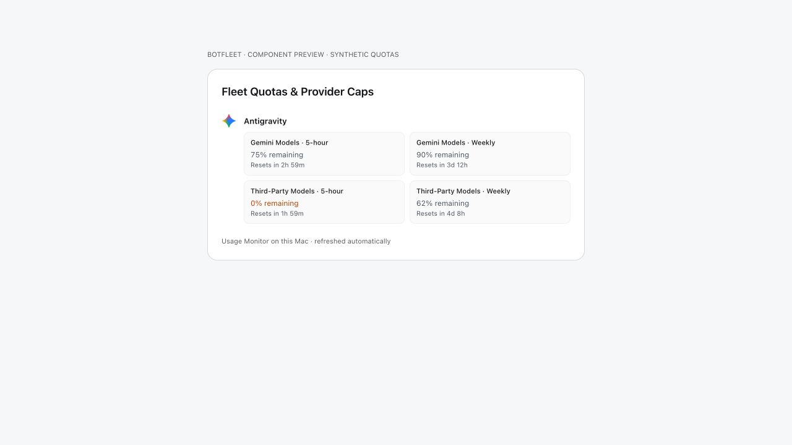

# Usage Monitor quotas on Mac

BotFleet reads the native Usage Monitor app's local subscription windows in Settings → Usage.  Keep Usage Monitor open to refresh the snapshot every five minutes; no server token is required for this local handoff.

The source is `~/Library/Application Support/Usage Monitor/quota-windows.json`, format `usage-monitor-local-quotas` version 1.  Usage Monitor writes only quota fields, atomically, with mode 0600 in a mode-0700 directory.  BotFleet accepts a regular same-user file, rejects symlinks and files over 1 MiB, and expires observations after ten minutes.  Malformed, missing, future-dated, and unsupported records are ignored.

Local readings replace the remote display for that entire provider, including unknown windows, so a remote account cannot supply another account's missing weekly cap.  Local observations are display-only: the existing authenticated server quota feed remains responsible for routing cooldowns.  A passed reset shows an unknown value until a new reading arrives.

Antigravity displays four shared windows: Gemini Models and Third-Party Models, each with a 5-hour and weekly cap.  When the native app is unavailable, BotFleet can still show its legacy local 5-hour observations; weekly quotas remain unknown, and monthly prompt credits are never shown as a subscription percentage.  MiniMax video/Hailuo allowances stay in collapsed details and do not determine coding availability.  Grok CLI remains supported; Grok Bot is excluded from both display and routing because BotFleet cannot run it.  Gemini CLI, Windsurf, GitHub Copilot, and Kimi are excluded from this quota display.

The native app lives in the Usage Monitor repository under `macos/`.  This BotFleet change targets the Mac/Electron UI and server; it does not add an iOS quota screen.

Validation includes the snapshot parser's freshness, file, provider, and account boundaries; no-server polling and expiry; four-window Antigravity normalization; Grok Bot routing exclusion; and a rendered preview of the actual quota grid.  The screenshot below uses explicitly synthetic values; it is not a live account capture.

